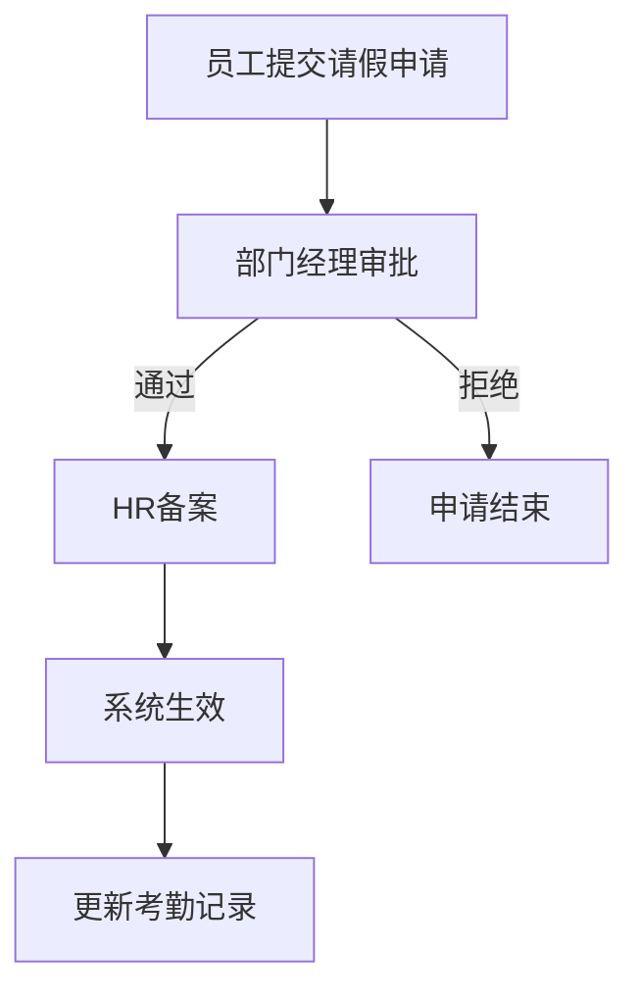
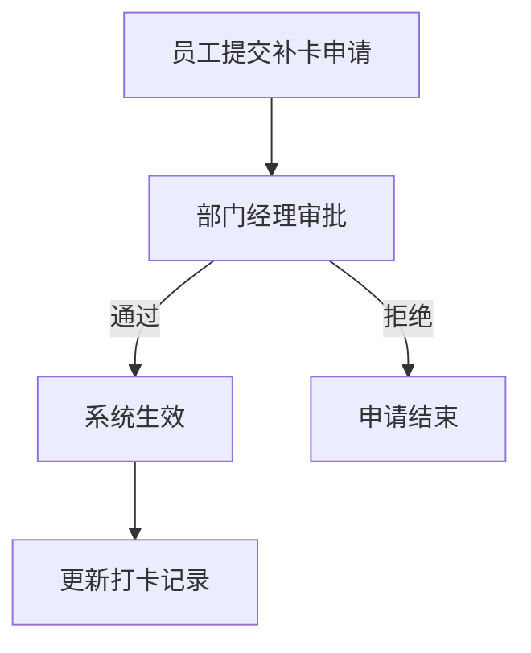
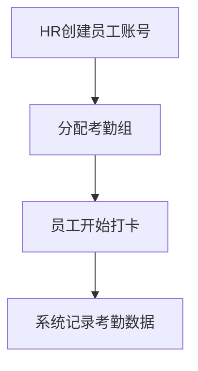

# 考勤管理系统 产品需求文档

## 文档信息

| 项目 | 内容 |
|------|------|
| 文档版本 | V1.0 |
| 创建日期 | 2026-03-25 |
| 最后修改 | 2026-03-25 |

## 修订历史

| 版本 | 日期 | 修改人 | 修改内容 |
|------|------|--------|----------|
| V1.0 | 2026-03-25 | - | 初始版本 |

---

## 1. 产品概述

### 1.1 产品简介

考勤管理系统是基于考勤门禁机的企业考勤管理平台，用户通过对人员制定不同考勤计划，实现考勤管理（记录统计、报表生成、异常管理、迟到/早退查看）等功能。系统支持从考勤门禁机同步打卡数据，提供完整的考勤数据管理和统计分析能力。

### 1.2 目标用户

- **企业员工**：需要进行日常上下班打卡、请假申请、补卡申请的普通员工
- **HR管理员**：负责考勤规则配置、异常处理、报表统计的人力资源管理人员
- **部门经理**：需要审批下属考勤异常、查看团队考勤情况的管理人员
- **系统管理员**：负责系统配置、权限管理、数据维护的IT运维人员

### 1.3 核心价值

- 为TUMS3.0补充考勤能力，满足企业、园区等场景的考勤管理需求
- 避免客户需要单独使用其他考勤系统，降低系统复杂度和运维成本
- 实现考勤数据统一管理，为企业薪酬计算和绩效评估提供数据支持
- 提高考勤管理效率，减少人工统计工作量

### 1.4 产品范围

本系统涵盖考勤组管理、班次管理、打卡记录、请假管理、考勤报表五大核心功能模块，支持考勤数据从采集、处理到统计分析的全流程管理。

---

## 2. 用户角色

### 2.1 角色概览

| 角色名称 | 角色类型 | 职责描述 | 使用场景 |
|----------|----------|----------|----------|
| 企业员工 | 业务角色 | 个人考勤查看、异常申请 | 日常上下班打卡、请假/补卡申请 |
| HR管理员 | 业务角色 | 考勤规则配置、异常处理、报表统计 | 制定考勤计划、处理考勤异常、生成报表 |
| 部门经理 | 业务角色 | 审批下属考勤异常、查看团队考勤 | 审批请假/补卡、监督团队出勤 |
| 系统管理员 | 系统角色 | 系统配置、权限管理、数据维护 | 系统初始化、用户权限分配 |

### 2.2 角色详情

#### 企业员工

| 属性 | 描述 |
|------|------|
| 角色类型 | 业务角色 |
| 职责描述 | 个人考勤查看、异常申请 |
| 使用场景 | 日常上下班打卡、请假/补卡申请 |
| 权限特征 | 仅查看个人考勤数据 |

#### HR管理员

| 属性 | 描述 |
|------|------|
| 角色类型 | 业务角色 |
| 职责描述 | 考勤规则配置、异常处理、报表统计 |
| 使用场景 | 制定考勤计划、处理考勤异常、生成报表 |
| 权限特征 | 管理全员考勤数据、配置权限 |

#### 部门经理

| 属性 | 描述 |
|------|------|
| 角色类型 | 业务角色 |
| 职责描述 | 审批下属考勤异常、查看团队考勤 |
| 使用场景 | 审批请假/补卡、监督团队出勤 |
| 权限特征 | 查看本部门考勤数据、审批权限 |

#### 系统管理员

| 属性 | 描述 |
|------|------|
| 角色类型 | 系统角色 |
| 职责描述 | 系统配置、权限管理、数据维护 |
| 使用场景 | 系统初始化、用户权限分配 |
| 权限特征 | 全局管理权限、系统配置权限 |

---

## 3. 功能模块

### 3.1 模块概览

| 序号 | 模块名称 | 模块描述 | 核心功能 | 主要角色 |
|------|----------|----------|----------|----------|
| 1 | 考勤组 | 设置不同考勤组方便管理 | 新增、查询、编辑、删除考勤组 | HR管理员 |
| 2 | 班次管理 | 定义不同的工作时段 | 新增、查询、编辑、删除班次 | HR管理员 |
| 3 | 打卡记录 | 管理员工上下班打卡数据 | 查看记录、补卡申请、数据同步 | 企业员工、HR管理员、部门经理 |
| 4 | 请假管理 | 处理请假申请和审批 | 请假申请、审批、统计 | 企业员工、部门经理、HR管理员 |
| 5 | 考勤报表 | 生成考勤统计报表 | 日报、月报、异常统计、导出 | HR管理员、部门经理 |

### 3.2 模块详情

#### 3.2.1 考勤组

**模块概述**

| 属性 | 描述 |
|------|------|
| 模块描述 | 设置不同考勤组方便管理，支持对企业内不同部门或岗位设置独立的考勤规则 |
| 主要用途 | 实现企业考勤规则的灵活配置，满足不同岗位、部门的差异化考勤管理需求 |
| 使用角色 | HR管理员 |

**功能清单**

| 功能ID | 功能名称 | 功能类型 | 操作角色 | 优先级 |
|--------|----------|----------|----------|--------|
| F01-01 | 新增考勤组 | 新增 | HR管理员 | 高 |
| F01-02 | 查询考勤组 | 查询 | HR管理员 | 高 |
| F01-03 | 编辑考勤组 | 修改 | HR管理员 | 高 |
| F01-04 | 删除考勤组 | 删除 | HR管理员 | 中 |
| F01-05 | 查看详情 | 查询 | HR管理员 | 高 |
| F01-06 | 批量导入考勤组 | 导入 | HR管理员 | 中 |

**功能详情**

##### 新增考勤组

| 属性 | 描述 |
|------|------|
| 功能ID | F01-01 |
| 功能类型 | 新增 |
| 操作角色 | HR管理员 |
| 优先级 | 高 |
| 前置条件 | 用户已登录系统，具有HR管理员权限 |
| 输入信息 | 考勤组名称、考勤组描述、上班时间、下班时间、迟到宽限时间、早退宽限时间、参与人员 |
| 输出结果 | 创建成功的考勤组记录，并返回考勤组ID |
| 操作流程 | 1.进入考勤组管理页面 → 2.点击"新增考勤组"按钮 → 3.填写考勤组基本信息 → 4.设置考勤时间规则 → 5.选择参与人员 → 6.点击保存 → 7.系统校验通过后保存 |

**输入字段定义**

| 字段名称 | 字段类型 | 是否必填 | 校验规则 | 默认值 | 说明 |
|----------|----------|----------|----------|--------|------|
| 考勤组名称 | 文本 | 是 | 长度2-50字符，不可重复 | - | 考勤组的唯一标识名称 |
| 考勤组描述 | 文本 | 否 | 长度0-200字符 | - | 考勤组的用途说明 |
| 上班时间 | 时间 | 是 | 格式HH:mm | 09:00 | 考勤打卡的起始时间 |
| 下班时间 | 时间 | 是 | 格式HH:mm，需晚于上班时间 | 18:00 | 考勤打卡的结束时间 |
| 迟到宽限时间 | 数字 | 否 | 0-60分钟 | 0 | 允许迟到的宽限分钟数 |
| 早退宽限时间 | 数字 | 否 | 0-60分钟 | 0 | 允许早退的宽限分钟数 |
| 参与人员 | 多选 | 否 | 从系统员工列表选择 | - | 该考勤组适用的人员 |

##### 查询考勤组

| 属性 | 描述 |
|------|------|
| 功能ID | F01-02 |
| 功能类型 | 查询 |
| 操作角色 | HR管理员 |
| 优先级 | 高 |
| 前置条件 | 用户已登录系统，具有HR管理员权限 |
| 输入信息 | 考勤组名称（模糊查询）、状态 |
| 输出结果 | 符合条件的考勤组列表，包含考勤组名称、人员数量、创建时间等信息 |
| 操作流程 | 1.进入考勤组管理页面 → 2.输入查询条件 → 3.点击查询按钮 → 4.系统返回符合条件的列表 |

**输入字段定义**

| 字段名称 | 字段类型 | 是否必填 | 校验规则 | 默认值 | 说明 |
|----------|----------|----------|----------|--------|------|
| 考勤组名称 | 文本 | 否 | 长度1-50字符 | - | 支持模糊查询 |
| 状态 | 下拉 | 否 | 启用/禁用 | 全部 | 考勤组的当前状态 |

##### 编辑考勤组

| 属性 | 描述 |
|------|------|
| 功能ID | F01-03 |
| 功能类型 | 修改 |
| 操作角色 | HR管理员 |
| 优先级 | 高 |
| 前置条件 | 用户已登录系统，具有HR管理员权限，考勤组已存在 |
| 输入信息 | 需要修改的字段信息 |
| 输出结果 | 更新后的考勤组记录 |
| 操作流程 | 1.在考勤组列表选择目标记录 → 2.点击"编辑"按钮 → 3.修改表单内容 → 4.点击保存 → 5.系统校验通过后更新 |

##### 删除考勤组

| 属性 | 描述 |
|------|------|
| 功能ID | F01-04 |
| 功能类型 | 删除 |
| 操作角色 | HR管理员 |
| 优先级 | 中 |
| 前置条件 | 用户已登录系统，具有HR管理员权限，考勤组已存在，考勤组无关联人员 |
| 输入信息 | 考勤组ID |
| 输出结果 | 删除成功提示，考勤组从列表中移除 |
| 操作流程 | 1.在考勤组列表选择目标记录 → 2.点击"删除"按钮 → 3.系统校验是否有关联人员 → 4.弹出确认对话框 → 5.确认删除 → 6.系统执行删除操作 |

##### 查看详情

| 属性 | 描述 |
|------|------|
| 功能ID | F01-05 |
| 功能类型 | 查询 |
| 操作角色 | HR管理员 |
| 优先级 | 高 |
| 前置条件 | 用户已登录系统，具有HR管理员权限，考勤组已存在 |
| 输入信息 | 考勤组ID |
| 输出结果 | 考勤组完整详细信息，包含基本信息、考勤规则、参与人员列表 |
| 操作流程 | 1.在考勤组列表选择目标记录 → 2.点击"查看详情"按钮 → 3.系统展示考勤组完整信息 |

##### 批量导入考勤组

| 属性 | 描述 |
|------|------|
| 功能ID | F01-06 |
| 功能类型 | 导入 |
| 操作角色 | HR管理员 |
| 优先级 | 中 |
| 前置条件 | 用户已登录系统，具有HR管理员权限 |
| 输入信息 | Excel文件（包含考勤组数据） |
| 输出结果 | 导入结果报告，包含成功数量、失败数量及失败原因 |
| 操作流程 | 1.点击"批量导入"按钮 → 2.下载导入模板 → 3.按模板格式填写数据 → 4.选择文件上传 → 5.系统校验数据格式 → 6.展示预览结果 → 7.确认导入 → 8.返回导入结果 |

**输入字段定义**

| 字段名称 | 字段类型 | 是否必填 | 校验规则 | 默认值 | 说明 |
|----------|----------|----------|----------|--------|------|
| 导入文件 | 文件 | 是 | 仅支持.xlsx/.xls格式，文件大小≤5MB | - | 包含考勤组数据的Excel文件 |

**业务逻辑**

| 规则ID | 规则名称 | 规则类型 | 触发条件 | 处理逻辑 |
|--------|----------|----------|----------|----------|
| BL01-01 | 考勤组名称唯一性校验 | 数据校验 | 新增或编辑考勤组时 | 检查考勤组名称是否已存在，若存在则提示"考勤组名称已存在，请修改" |
| BL01-02 | 考勤时间有效性校验 | 数据校验 | 新增或编辑考勤组时 | 检查下班时间必须晚于上班时间，否则提示"下班时间必须晚于上班时间" |
| BL01-03 | 删除前关联检查 | 业务约束 | 删除考勤组时 | 检查考勤组是否有关联人员，若有则禁止删除并提示"该考勤组存在关联人员，请先移除人员" |
| BL01-04 | 宽限时间范围校验 | 数据校验 | 新增或编辑考勤组时 | 迟到/早退宽限时间需在0-60分钟范围内，超出范围则提示"宽限时间需在0-60分钟之间" |
| BL01-05 | 批量导入重复检测 | 数据校验 | 批量导入考勤组时 | 检查导入数据中是否存在重复的考勤组名称，标记为导入失败 |
| BL01-06 | 批量导入格式校验 | 数据校验 | 批量导入考勤组时 | 检查Excel文件格式是否符合模板要求，不符合则提示具体错误信息 |

**约束条件**

| 约束ID | 约束类型 | 约束对象 | 约束描述 | 错误提示 |
|--------|----------|----------|----------|----------|
| C01-01 | 唯一性约束 | 考勤组名称 | 考勤组名称在系统内必须唯一，不可重复 | 考勤组名称已存在，请修改 |
| C01-02 | 时间约束 | 上下班时间 | 下班时间必须晚于上班时间 | 下班时间必须晚于上班时间 |
| C01-03 | 数值约束 | 宽限时间 | 迟到/早退宽限时间范围为0-60分钟 | 宽限时间需在0-60分钟之间 |
| C01-04 | 关联约束 | 考勤组删除 | 存在关联人员的考勤组不可删除 | 该考勤组存在关联人员，请先移除人员 |
| C01-05 | 格式约束 | 导入文件 | 导入文件仅支持.xlsx/.xls格式 | 文件格式不支持，请上传Excel文件 |
| C01-06 | 大小约束 | 导入文件 | 导入文件大小不超过5MB | 文件大小超过限制，请减小文件大小 |
| C01-07 | 长度约束 | 考勤组名称 | 考勤组名称长度限制2-50字符 | 考勤组名称长度需在2-50字符之间 |
| C01-08 | 长度约束 | 考勤组描述 | 考勤组描述长度限制0-200字符 | 考勤组描述长度不能超过200字符 |

---

#### 3.2.2 班次管理

**模块概述**

| 属性 | 描述 |
|------|------|
| 模块描述 | 班次管理用于定义不同的工作时段，如早班、晚班、弹性班等，供考勤组关联使用。 |
| 主要用途 | 为考勤规则提供标准化班次定义，支持企业灵活排班管理，确保考勤计算的准确性。 |
| 使用角色 | HR管理员 |

**功能清单**

| 功能ID | 功能名称 | 功能类型 | 操作角色 | 优先级 |
|--------|----------|----------|----------|--------|
| F02-01 | 新增班次 | 新增 | HR管理员 | 高 |
| F02-02 | 查询班次 | 查询 | HR管理员 | 高 |
| F02-03 | 编辑班次 | 修改 | HR管理员 | 高 |
| F02-04 | 删除班次 | 删除 | HR管理员 | 中 |
| F02-05 | 班次详情 | 查询 | HR管理员 | 高 |

**功能详情**

##### 新增班次

| 属性 | 描述 |
|------|------|
| 功能ID | F02-01 |
| 功能类型 | 新增 |
| 操作角色 | HR管理员 |
| 优先级 | 高 |
| 前置条件 | 1. 用户已登录系统 2. 用户具有HR管理员权限 |
| 输入信息 | 班次名称、工作时段、休息时间、打卡规则、是否启用 |
| 输出结果 | 创建成功提示，生成班次ID |
| 操作流程 | 1. 进入班次管理页面 → 2. 点击"新增班次"按钮 → 3. 填写班次基本信息 → 4. 配置工作时段 → 5. 设置休息时间 → 6. 配置打卡规则 → 7. 点击保存 → 8. 系统校验并创建班次 |

**输入字段定义**

| 字段名称 | 字段类型 | 是否必填 | 校验规则 | 默认值 | 说明 |
|----------|----------|----------|----------|--------|------|
| 班次名称 | 文本 | 是 | 1-20字符，不能重复 | - | 班次的唯一标识名称 |
| 班次编码 | 文本 | 否 | 字母数字，最多10字符 | 自动生成 | 系统自动生成或手动输入 |
| 上班时间 | 时间 | 是 | 格式HH:mm | 09:00 | 工作日开始时间 |
| 下班时间 | 时间 | 是 | 格式HH:mm，需晚于上班时间 | 18:00 | 工作日结束时间 |
| 弹性时长 | 数字 | 否 | 0-120分钟 | 0 | 允许迟到/早退的弹性范围 |
| 午休开始 | 时间 | 否 | 格式HH:mm | 12:00 | 午休起始时间 |
| 午休结束 | 时间 | 否 | 格式HH:mm，需晚于午休开始 | 13:00 | 午休结束时间 |
| 是否启用 | 开关 | 是 | - | 是 | 班次是否立即生效 |
| 备注 | 文本 | 否 | 最多200字符 | - | 班次补充说明 |

##### 查询班次

| 属性 | 描述 |
|------|------|
| 功能ID | F02-02 |
| 功能类型 | 查询 |
| 操作角色 | HR管理员 |
| 优先级 | 高 |
| 前置条件 | 1. 用户已登录系统 2. 用户具有HR管理员权限 |
| 输入信息 | 查询条件（班次名称、状态） |
| 输出结果 | 符合条件的班次列表 |
| 操作流程 | 1. 进入班次管理页面 → 2. 输入查询条件 → 3. 点击查询按钮 → 4. 系统返回班次列表 |

##### 编辑班次

| 属性 | 描述 |
|------|------|
| 功能ID | F02-03 |
| 功能类型 | 修改 |
| 操作角色 | HR管理员 |
| 优先级 | 高 |
| 前置条件 | 1. 用户已登录系统 2. 班次存在且可编辑 3. 若班次已关联考勤组，需提示确认 |
| 输入信息 | 修改后的班次信息 |
| 输出结果 | 修改成功提示，更新班次信息 |
| 操作流程 | 1. 查询并选中班次 → 2. 点击"编辑"按钮 → 3. 修改班次信息 → 4. 点击保存 → 5. 系统校验并更新 |

##### 删除班次

| 属性 | 描述 |
|------|------|
| 功能ID | F02-04 |
| 功能类型 | 删除 |
| 操作角色 | HR管理员 |
| 优先级 | 中 |
| 前置条件 | 1. 用户已登录系统 2. 班次存在 3. 班次未被任何考勤组关联 |
| 输入信息 | 班次ID |
| 输出结果 | 删除成功提示 |
| 操作流程 | 1. 查询并选中班次 → 2. 点击"删除"按钮 → 3. 系统校验关联关系 → 4. 弹出确认提示 → 5. 确认删除 |

##### 班次详情

| 属性 | 描述 |
|------|------|
| 功能ID | F02-05 |
| 功能类型 | 查询 |
| 操作角色 | HR管理员 |
| 优先级 | 高 |
| 前置条件 | 1. 用户已登录系统 2. 班次存在 |
| 输入信息 | 班次ID |
| 输出结果 | 班次完整信息（含关联考勤组数量） |
| 操作流程 | 1. 查询班次列表 → 2. 点击班次名称或"详情"按钮 → 3. 系统展示班次详情页 |

**业务逻辑**

| 规则ID | 规则名称 | 规则类型 | 触发条件 | 处理逻辑 |
|--------|----------|----------|----------|----------|
| BL02-01 | 班次名称唯一性校验 | 校验规则 | 新增/编辑班次时 | 系统检查同名班次是否存在，存在则提示"班次名称已存在" |
| BL02-02 | 工作时长计算 | 计算规则 | 保存班次时 | 工作时长 = 下班时间 - 上班时间 - 午休时长，结果需大于0 |
| BL02-03 | 时间逻辑校验 | 校验规则 | 保存班次时 | 下班时间必须晚于上班时间；午休结束必须晚于午休开始 |
| BL02-04 | 关联考勤组检查 | 业务规则 | 删除班次时 | 检查班次是否被考勤组引用，若已关联则禁止删除并提示关联的考勤组 |
| BL02-05 | 弹性打卡计算 | 计算规则 | 考勤打卡时 | 若设置弹性时长，上班打卡时间在弹性范围内视为正常出勤 |
| BL02-06 | 班次状态变更 | 业务规则 | 启用/禁用班次时 | 禁用班次后，新考勤组不可关联该班次，已关联的不受影响 |

**约束条件**

| 约束ID | 约束类型 | 约束对象 | 约束描述 | 错误提示 |
|--------|----------|----------|----------|----------|
| C02-01 | 唯一性约束 | 班次名称 | 班次名称在系统内不可重复 | 班次名称已存在，请修改 |
| C02-02 | 时间约束 | 工作时段 | 下班时间必须晚于上班时间至少1小时 | 工作时段设置不合理，请检查 |
| C02-03 | 关联约束 | 班次删除 | 被考勤组关联的班次不可删除 | 该班次已被XX个考勤组关联，无法删除 |
| C02-04 | 必填约束 | 核心字段 | 班次名称、上班时间、下班时间为必填项 | 请填写完整的班次基本信息 |
| C02-05 | 长度约束 | 班次名称 | 班次名称长度限制1-20个字符 | 班次名称长度不符合要求 |
| C02-06 | 数值约束 | 弹性时长 | 弹性时长范围0-120分钟 | 弹性时长超出允许范围 |

---

#### 3.2.3 打卡记录

**模块概述**

| 属性 | 描述 |
|------|------|
| 模块描述 | 打卡记录模块用于管理和查看员工的上下班打卡数据，支持从考勤门禁机同步数据。 |
| 主要用途 | 记录员工考勤打卡信息，支持打卡数据查询、补卡申请、数据导出和门禁同步，为考勤统计和薪资计算提供数据基础。 |
| 使用角色 | 企业员工、HR管理员、部门经理、系统管理员 |

**功能清单**

| 功能ID | 功能名称 | 功能类型 | 操作角色 | 优先级 |
|--------|----------|----------|----------|--------|
| F03-01 | 查看个人打卡记录 | 查询 | 企业员工 | 高 |
| F03-02 | 查询打卡记录 | 查询 | HR管理员/部门经理 | 高 |
| F03-03 | 打卡详情 | 查询 | 全部角色 | 高 |
| F03-04 | 补卡申请 | 新增 | 企业员工 | 高 |
| F03-05 | 导出打卡记录 | 导出 | HR管理员 | 中 |
| F03-06 | 数据同步 | 同步 | 系统管理员 | 高 |

**功能详情**

##### 查看个人打卡记录

| 属性 | 描述 |
|------|------|
| 功能ID | F03-01 |
| 功能类型 | 查询 |
| 操作角色 | 企业员工 |
| 优先级 | 高 |
| 前置条件 | 用户已登录系统，具有员工角色权限 |
| 输入信息 | 查询条件：日期范围（可选） |
| 输出结果 | 个人打卡记录列表，包含打卡日期、上班打卡时间、下班打卡时间、打卡状态、打卡地点 |
| 操作流程 | 1. 进入打卡记录模块 → 2. 系统默认显示当月打卡记录 → 3. 可选择日期范围筛选 → 4. 查看打卡记录列表 |

##### 查询打卡记录

| 属性 | 描述 |
|------|------|
| 功能ID | F03-02 |
| 功能类型 | 查询 |
| 操作角色 | HR管理员/部门经理 |
| 优先级 | 高 |
| 前置条件 | 用户已登录系统，具有HR管理员或部门经理角色权限 |
| 输入信息 | 查询条件：员工姓名/工号、部门、日期范围、打卡状态 |
| 输出结果 | 打卡记录列表，支持分页显示，包含员工信息、打卡日期、打卡时间、打卡状态、打卡地点 |
| 操作流程 | 1. 进入打卡记录管理页面 → 2. 设置查询条件 → 3. 点击查询按钮 → 4. 查看符合条件的打卡记录列表 → 5. 可点击某条记录查看详情 |

##### 打卡详情

| 属性 | 描述 |
|------|------|
| 功能ID | F03-03 |
| 功能类型 | 查询 |
| 操作角色 | 全部角色 |
| 优先级 | 高 |
| 前置条件 | 已选择某条打卡记录，用户具有查看权限 |
| 输入信息 | 打卡记录ID |
| 输出结果 | 打卡详细信息，包含员工基本信息、打卡日期、上下班打卡时间、打卡地点、打卡设备、打卡状态、异常原因（如有）、补卡记录（如有） |
| 操作流程 | 1. 在打卡记录列表点击详情按钮 → 2. 弹窗显示打卡详细信息 → 3. 可查看关联的补卡申请记录 → 4. 点击关闭返回列表 |

##### 补卡申请

| 属性 | 描述 |
|------|------|
| 功能ID | F03-04 |
| 功能类型 | 新增 |
| 操作角色 | 企业员工 |
| 优先级 | 高 |
| 前置条件 | 用户已登录系统，具有员工角色权限；当前日期在允许补卡的时间范围内 |
| 输入信息 | 补卡日期、补卡类型（上班/下班）、补卡原因、附件材料 |
| 输出结果 | 提交成功提示，补卡申请进入审批流程 |
| 操作流程 | 1. 进入打卡记录页面 → 2. 点击补卡申请按钮 → 3. 填写补卡信息 → 4. 上传相关证明材料（可选） → 5. 提交申请 → 6. 等待审批结果 |

**输入字段定义**

| 字段名称 | 字段类型 | 是否必填 | 校验规则 | 默认值 | 说明 |
|----------|----------|----------|----------|--------|------|
| 补卡日期 | 日期选择器 | 是 | 不能晚于当前日期，且在允许补卡期限内 | 无 | 申请补卡的日期 |
| 补卡类型 | 单选按钮 | 是 | 上班打卡/下班打卡 | 无 | 选择补卡类型 |
| 补卡时间 | 时间选择器 | 是 | 必须在合理时间范围内 | 无 | 实际打卡时间 |
| 补卡原因 | 下拉选择+文本 | 是 | 必须选择或填写原因 | 无 | 如：设备故障、忘记打卡、外出办公等 |
| 详细说明 | 多行文本框 | 否 | 最多500字 | 空 | 详细描述补卡原因 |
| 附件材料 | 文件上传 | 否 | 支持jpg/png/pdf，单个文件≤5MB | 无 | 相关证明材料 |

##### 导出打卡记录

| 属性 | 描述 |
|------|------|
| 功能ID | F03-05 |
| 功能类型 | 导出 |
| 操作角色 | HR管理员 |
| 优先级 | 中 |
| 前置条件 | 用户已登录系统，具有HR管理员角色权限；已查询出需要导出的数据 |
| 输入信息 | 导出范围（当前查询结果/全部）、导出格式 |
| 输出结果 | Excel文件下载，包含筛选条件内的所有打卡记录 |
| 操作流程 | 1. 设置查询条件并查询数据 → 2. 点击导出按钮 → 3. 选择导出范围和格式 → 4. 点击确认导出 → 5. 下载Excel文件 |

##### 数据同步

| 属性 | 描述 |
|------|------|
| 功能ID | F03-06 |
| 功能类型 | 同步 |
| 操作角色 | 系统管理员 |
| 优先级 | 高 |
| 前置条件 | 用户已登录系统，具有系统管理员角色权限；考勤门禁机已配置连接 |
| 输入信息 | 同步日期范围、同步设备（可选） |
| 输出结果 | 同步结果提示，显示成功同步记录数、失败记录数及失败原因 |
| 操作流程 | 1. 进入系统管理-数据同步页面 → 2. 选择同步日期范围 → 3. 选择同步设备或全部设备 → 4. 点击开始同步 → 5. 等待同步完成 → 6. 查看同步结果报告 |

**业务逻辑**

| 规则ID | 规则名称 | 规则类型 | 触发条件 | 处理逻辑 |
|--------|----------|----------|----------|----------|
| BL03-01 | 打卡状态判定 | 计算规则 | 每次打卡数据录入或同步时 | 根据班次时间配置，判断打卡是否在规定时间范围内：上班打卡在规定上班时间前后30分钟内为正常，下班打卡在规定下班时间后为正常，否则标记为异常 |
| BL03-02 | 缺卡判定 | 计算规则 | 每日考勤统计时 | 如果员工当天有排班但无对应打卡记录（上班或下班），标记为缺卡状态 |
| BL03-03 | 补卡申请时限 | 业务规则 | 员工提交补卡申请时 | 补卡申请只能在缺卡日期后的N个工作日内提交（默认7天），超过时限不允许提交 |
| BL03-04 | 补卡申请去重 | 校验规则 | 员工提交补卡申请时 | 检查同一日期、同一类型（上班/下班）是否已存在补卡申请，若存在则拒绝提交并提示 |
| BL03-05 | 部门经理数据权限 | 权限规则 | 部门经理查询打卡记录时 | 部门经理只能查看本部门员工的打卡记录，不能查看其他部门数据 |
| BL03-06 | 数据同步去重 | 同步规则 | 从门禁机同步数据时 | 根据员工工号+打卡时间判断是否已存在记录，已存在则跳过，避免重复数据 |
| BL03-07 | 跨天打卡处理 | 计算规则 | 员工下班打卡时间在次日凌晨时 | 将下班打卡时间归属到上班打卡对应的日期，支持跨零点班次 |

**约束条件**

| 约束ID | 约束类型 | 约束对象 | 约束描述 | 错误提示 |
|--------|----------|----------|----------|----------|
| C03-01 | 数据范围 | 查询打卡记录 | 普通员工只能查询自己的打卡记录 | 您没有权限查看其他员工的打卡记录 |
| C03-02 | 时间限制 | 补卡申请 | 补卡日期不能晚于当前日期 | 补卡日期不能选择未来的日期 |
| C03-03 | 时间限制 | 补卡申请 | 补卡申请必须在允许的时限内提交 | 该日期已超过补卡申请时限（7个工作日），无法提交 |
| C03-04 | 文件限制 | 补卡申请附件 | 附件文件大小不超过5MB，仅支持jpg/png/pdf格式 | 文件大小超出限制或格式不支持，请重新上传 |
| C03-05 | 操作频率 | 数据同步 | 同一设备的数据同步间隔不能少于5分钟 | 同步操作过于频繁，请5分钟后再试 |
| C03-06 | 数据导出 | 导出打卡记录 | 单次导出数据量不超过10000条 | 导出数据量过大，请缩小查询范围后重试 |
| C03-07 | 数据完整性 | 打卡详情 | 打卡记录被删除后无法查看详情 | 该打卡记录不存在或已被删除 |

---

#### 3.2.4 请假管理

**模块概述**

| 属性 | 描述 |
|------|------|
| 模块描述 | 请假管理模块用于处理员工的请假申请、审批和记录管理，支持多种请假类型，包括年假、事假、病假、婚假、产假等。 |
| 主要用途 | 规范企业请假流程，实现请假申请、审批、记录查询的电子化管理，确保请假数据的准确性和可追溯性。 |
| 使用角色 | 企业员工、部门经理、HR管理员 |

**功能清单**

| 功能ID | 功能名称 | 功能类型 | 操作角色 | 优先级 |
|--------|----------|----------|----------|--------|
| F04-01 | 新增请假申请 | 新增 | 企业员工 | 高 |
| F04-02 | 查询请假记录 | 查询 | 全部角色 | 高 |
| F04-03 | 修改请假申请 | 修改 | 企业员工 | 高 |
| F04-04 | 撤销请假申请 | 删除 | 企业员工 | 中 |
| F04-05 | 请假详情 | 查询 | 全部角色 | 高 |
| F04-06 | 请假审批 | 审核 | 部门经理/HR管理员 | 高 |
| F04-07 | 请假统计 | 统计 | HR管理员 | 中 |
| F04-08 | 假期余额管理 | 管理 | HR管理员 | 高 |

**功能详情**

##### 新增请假申请

| 属性 | 描述 |
|------|------|
| 功能ID | F04-01 |
| 功能类型 | 新增 |
| 操作角色 | 企业员工 |
| 优先级 | 高 |
| 前置条件 | 1. 用户已登录系统；2. 用户具有员工角色；3. 请假开始日期未过期 |
| 输入信息 | 请假类型、开始日期、结束日期、请假天数、请假事由、附件（可选） |
| 输出结果 | 生成请假申请单，状态为"待审批"，发送审批通知给相应审批人 |
| 操作流程 | 1. 进入请假申请页面 → 2. 选择请假类型 → 3. 填写开始/结束日期 → 4. 系统自动计算请假天数 → 5. 填写请假事由 → 6. 上传附件（可选）→ 7. 确认提交 → 8. 系统校验假期余额 → 9. 生成申请单并通知审批人 |

**输入字段定义**

| 字段名称 | 字段类型 | 是否必填 | 校验规则 | 默认值 | 说明 |
|----------|----------|----------|----------|--------|------|
| 请假类型 | 下拉选择 | 是 | 必须为系统预置类型 | 无 | 年假/事假/病假/婚假/产假/陪产假/丧假/调休 |
| 开始日期 | 日期 | 是 | 不能早于当天，格式YYYY-MM-DD | 当天 | 请假起始日期 |
| 结束日期 | 日期 | 是 | 不能早于开始日期，格式YYYY-MM-DD | 当天 | 请假截止日期 |
| 开始时段 | 下拉选择 | 是 | 上午/下午 | 上午 | 开始日期的时段 |
| 结束时段 | 下拉选择 | 是 | 上午/下午 | 下午 | 结束日期的时段 |
| 请假天数 | 数字 | 是 | 自动计算，精确到0.5天 | 自动计算 | 根据开始/结束日期和时段自动计算 |
| 请假事由 | 文本域 | 是 | 最大500字符 | 无 | 详细描述请假原因 |
| 附件 | 文件上传 | 否 | 最大10MB，支持jpg/png/pdf | 无 | 病假等需上传证明材料 |
| 审批人 | 选择 | 是 | 从部门经理列表选择 | 自动匹配 | 可手动选择审批人 |

##### 查询请假记录

| 属性 | 描述 |
|------|------|
| 功能ID | F04-02 |
| 功能类型 | 查询 |
| 操作角色 | 全部角色 |
| 优先级 | 高 |
| 前置条件 | 用户已登录系统 |
| 输入信息 | 查询条件：申请单号、请假类型、申请时间范围、审批状态、申请人 |
| 输出结果 | 符合条件的请假记录列表，支持分页显示 |
| 操作流程 | 1. 进入请假记录查询页面 → 2. 设置查询条件（可选）→ 3. 点击查询 → 4. 系统返回结果列表 → 5. 可点击查看详情 |

##### 修改请假申请

| 属性 | 描述 |
|------|------|
| 功能ID | F04-03 |
| 功能类型 | 修改 |
| 操作角色 | 企业员工 |
| 优先级 | 高 |
| 前置条件 | 1. 用户已登录系统；2. 申请单状态为"待审批"；3. 修改人为申请人本人 |
| 输入信息 | 可修改字段：请假类型、开始日期、结束日期、请假事由、附件 |
| 输出结果 | 更新请假申请单信息，重新发送审批通知，记录修改日志 |
| 操作流程 | 1. 进入请假详情页面 → 2. 点击修改按钮 → 3. 修改相关字段 → 4. 系统重新校验假期余额 → 5. 确认提交 → 6. 更新申请单并通知审批人 |

##### 撤销请假申请

| 属性 | 描述 |
|------|------|
| 功能ID | F04-04 |
| 功能类型 | 删除 |
| 操作角色 | 企业员工 |
| 优先级 | 中 |
| 前置条件 | 1. 用户已登录系统；2. 申请单状态为"待审批"；3. 操作人为申请人本人 |
| 输入信息 | 撤销原因 |
| 输出结果 | 申请单状态变更为"已撤销"，释放预占的假期余额，通知审批人 |
| 操作流程 | 1. 进入请假详情页面 → 2. 点击撤销按钮 → 3. 填写撤销原因 → 4. 确认撤销 → 5. 系统更新状态并释放余额 → 6. 发送通知给审批人 |

##### 请假详情

| 属性 | 描述 |
|------|------|
| 功能ID | F04-05 |
| 功能类型 | 查询 |
| 操作角色 | 全部角色 |
| 优先级 | 高 |
| 前置条件 | 1. 用户已登录系统；2. 有查看该申请单的权限（本人/本部门/全部） |
| 输入信息 | 申请单号（通过列表点击传入） |
| 输出结果 | 显示请假申请的完整信息，包括基本信息、审批记录、修改历史 |
| 操作流程 | 1. 从列表点击申请单 → 2. 系统加载详情页面 → 3. 显示完整信息 → 4. 根据用户角色显示相应操作按钮 |

##### 请假审批

| 属性 | 描述 |
|------|------|
| 功能ID | F04-06 |
| 功能类型 | 审核 |
| 操作角色 | 部门经理/HR管理员 |
| 优先级 | 高 |
| 前置条件 | 1. 用户已登录系统；2. 用户具有审批权限；3. 申请单状态为"待审批" |
| 输入信息 | 审批结果（通过/拒绝）、审批意见 |
| 输出结果 | 更新申请单状态，通过时扣减假期余额，通知申请人审批结果 |
| 操作流程 | 1. 进入待审批列表 → 2. 点击申请单查看详情 → 3. 查看请假信息和附件 → 4. 选择审批结果 → 5. 填写审批意见 → 6. 确认提交 → 7. 系统更新状态并扣减/释放余额 → 8. 通知申请人 |

##### 请假统计

| 属性 | 描述 |
|------|------|
| 功能ID | F04-07 |
| 功能类型 | 统计 |
| 操作角色 | HR管理员 |
| 优先级 | 中 |
| 前置条件 | 1. 用户已登录系统；2. 用户具有HR管理员角色 |
| 输入信息 | 统计条件：部门、时间段、请假类型、员工 |
| 输出结果 | 请假统计数据报表，支持图表展示和导出 |
| 操作流程 | 1. 进入请假统计页面 → 2. 设置筛选条件 → 3. 点击查询 → 4. 查看统计结果 → 5. 可导出Excel报表 |

##### 假期余额管理

| 属性 | 描述 |
|------|------|
| 功能ID | F04-08 |
| 功能类型 | 管理 |
| 操作角色 | HR管理员 |
| 优先级 | 高 |
| 前置条件 | 1. 用户已登录系统；2. 用户具有HR管理员角色 |
| 输入信息 | 员工选择、假期类型、总天数、已用天数、剩余天数、有效期 |
| 输出结果 | 更新员工假期余额记录，记录变更日志 |
| 操作流程 | 1. 进入假期余额管理页面 → 2. 查询员工 → 3. 查看/修改余额信息 → 4. 确认保存 → 5. 系统记录变更日志 |

**业务逻辑**

| 规则ID | 规则名称 | 规则类型 | 触发条件 | 处理逻辑 |
|--------|----------|----------|----------|----------|
| BL04-01 | 请假天数计算 | 计算规则 | 用户选择开始和结束日期 | 根据开始日期、结束日期、开始时段、结束时段自动计算请假天数，排除周末和法定节假日（可配置是否排除） |
| BL04-02 | 假期余额校验 | 校验规则 | 提交请假申请时 | 检查该员工对应假期类型的余额是否充足，不足时提示并禁止提交 |
| BL04-03 | 假期余额预占 | 业务规则 | 请假申请提交成功 | 预占相应天数的假期余额，防止重复申请超支 |
| BL04-04 | 假期余额扣减 | 业务规则 | 请假审批通过 | 正式扣减假期余额，预占转为实际扣减 |
| BL04-05 | 假期余额释放 | 业务规则 | 请假被拒绝或撤销 | 释放预占的假期余额，恢复可用余额 |
| BL04-06 | 审批人自动匹配 | 业务规则 | 提交请假申请时 | 根据申请人部门自动匹配部门经理作为默认审批人，员工可手动选择其他审批人 |
| BL04-07 | 审批超时提醒 | 定时规则 | 请假申请提交超过配置时限 | 系统自动发送提醒消息给审批人 |
| BL04-08 | 病假证明要求 | 校验规则 | 请假类型为病假且天数超过配置值 | 必须上传医院证明附件，否则禁止提交 |
| BL04-09 | 年假余额计算 | 计算规则 | 年初或员工入职 | 根据工作年限和公司政策计算年度年假额度 |
| BL04-10 | 假期余额结转 | 业务规则 | 年度结束时 | 根据公司政策处理未休年假，支持结转或清零 |

**约束条件**

| 约束ID | 约束类型 | 约束对象 | 约束描述 | 错误提示 |
|--------|----------|----------|----------|----------|
| C04-01 | 数据约束 | 请假开始日期 | 请假开始日期不能早于当天（可配置允许当天申请） | 请假开始日期不能早于今天 |
| C04-02 | 数据约束 | 请假天数 | 请假天数不能超过假期余额 | 假期余额不足，当前余额{X}天 |
| C04-03 | 数据约束 | 请假事由 | 请假事由不能为空，最长500字符 | 请填写请假事由，最多500字 |
| C04-04 | 状态约束 | 修改申请 | 只有待审批状态的申请单可以修改 | 当前状态不允许修改 |
| C04-05 | 状态约束 | 撤销申请 | 只有待审批状态的申请单可以撤销 | 当前状态不允许撤销 |
| C04-06 | 权限约束 | 查看权限 | 只能查看自己或本部门的请假记录，HR可查看全部 | 无权限查看该申请单 |
| C04-07 | 权限约束 | 审批权限 | 只能审批本部门的请假申请，HR可审批全部 | 无权限审批该申请单 |
| C04-08 | 数据约束 | 附件大小 | 单个附件不超过10MB，总附件不超过30MB | 附件大小超过限制 |
| C04-09 | 业务约束 | 病假证明 | 病假超过3天必须上传医院证明 | 病假超过3天需上传医院证明 |
| C04-10 | 数据约束 | 假期余额 | 剩余天数不能为负数 | 假期余额不能为负数 |

---

#### 3.2.5 考勤报表

**模块概述**

| 属性 | 描述 |
|------|------|
| 模块描述 | 考勤报表模块用于生成各类考勤统计报表，支持按部门、人员、时间段等维度统计，提供日报、月报、异常统计等多种报表类型。 |
| 主要用途 | 帮助HR管理员和部门经理全面掌握员工考勤情况，及时发现考勤异常，为薪酬计算和绩效评估提供数据支持。 |
| 使用角色 | HR管理员、部门经理 |

**功能清单**

| 功能ID | 功能名称 | 功能类型 | 操作角色 | 优先级 |
|--------|----------|----------|----------|--------|
| F05-01 | 考勤日报 | 统计 | HR管理员/部门经理 | 高 |
| F05-02 | 考勤月报 | 统计 | HR管理员 | 高 |
| F05-03 | 异常统计 | 统计 | HR管理员 | 高 |
| F05-04 | 请假统计 | 统计 | HR管理员 | 中 |
| F05-05 | 自定义报表 | 统计 | HR管理员 | 中 |
| F05-06 | 导出报表 | 导出 | HR管理员 | 高 |

**功能详情**

##### 考勤日报

| 属性 | 描述 |
|------|------|
| 功能ID | F05-01 |
| 功能类型 | 统计 |
| 操作角色 | HR管理员/部门经理 |
| 优先级 | 高 |
| 前置条件 | 1. 用户已登录系统 2. 用户具有考勤报表查看权限 3. 系统中存在当日考勤数据 |
| 输入信息 | 日期、部门、人员 |
| 输出结果 | 当日考勤统计表（包含出勤人数、迟到人数、早退人数、缺勤人数、请假人数等） |
| 操作流程 | 1. 进入考勤日报页面 → 2. 选择统计日期（默认当日）→ 3. 选择筛选条件（部门/人员，可选）→ 4. 点击"生成报表"按钮 → 5. 查看统计结果 → 6. 可选择导出报表 |

##### 考勤月报

| 属性 | 描述 |
|------|------|
| 功能ID | F05-02 |
| 功能类型 | 统计 |
| 操作角色 | HR管理员 |
| 优先级 | 高 |
| 前置条件 | 1. 用户已登录系统 2. 用户具有考勤报表查看权限 3. 系统中存在指定月份考勤数据 |
| 输入信息 | 年月、部门、人员 |
| 输出结果 | 月度考勤统计表（包含出勤天数、迟到次数、早退次数、请假天数、加班时长等汇总数据） |
| 操作流程 | 1. 进入考勤月报页面 → 2. 选择统计年月 → 3. 选择筛选条件（部门/人员，可选）→ 4. 点击"生成报表"按钮 → 5. 查看月度统计结果 → 6. 可选择导出报表 |

##### 异常统计

| 属性 | 描述 |
|------|------|
| 功能ID | F05-03 |
| 功能类型 | 统计 |
| 操作角色 | HR管理员 |
| 优先级 | 高 |
| 前置条件 | 1. 用户已登录系统 2. 用户具有考勤报表查看权限 3. 系统中存在考勤异常记录 |
| 输入信息 | 开始日期、结束日期、异常类型、部门 |
| 输出结果 | 考勤异常统计表（包含迟到、早退、缺卡、旷工等异常类型的统计数据） |
| 操作流程 | 1. 进入异常统计页面 → 2. 选择时间范围 → 3. 选择异常类型（可选）→ 4. 选择部门（可选）→ 5. 点击"统计"按钮 → 6. 查看异常统计结果 → 7. 可查看异常明细或导出报表 |

##### 请假统计

| 属性 | 描述 |
|------|------|
| 功能ID | F05-04 |
| 功能类型 | 统计 |
| 操作角色 | HR管理员 |
| 优先级 | 中 |
| 前置条件 | 1. 用户已登录系统 2. 用户具有考勤报表查看权限 3. 系统中存在请假记录 |
| 输入信息 | 开始日期、结束日期、请假类型、部门、人员 |
| 输出结果 | 请假统计表（包含各类请假类型的次数、天数、人员分布等统计数据） |
| 操作流程 | 1. 进入请假统计页面 → 2. 选择时间范围 → 3. 选择请假类型（可选）→ 4. 选择筛选条件（部门/人员，可选）→ 5. 点击"统计"按钮 → 6. 查看请假统计结果 → 7. 可选择导出报表 |

##### 自定义报表

| 属性 | 描述 |
|------|------|
| 功能ID | F05-05 |
| 功能类型 | 统计 |
| 操作角色 | HR管理员 |
| 优先级 | 中 |
| 前置条件 | 1. 用户已登录系统 2. 用户具有考勤报表查看权限 3. 系统中存在考勤基础数据 |
| 输入信息 | 报表名称、统计维度、统计指标、时间范围、筛选条件 |
| 输出结果 | 自定义考勤统计报表 |
| 操作流程 | 1. 进入自定义报表页面 → 2. 输入报表名称 → 3. 选择统计维度 → 4. 选择统计指标 → 5. 设置时间范围和筛选条件 → 6. 点击"生成报表"按钮 → 7. 查看自定义报表结果 → 8. 可保存为报表模板或导出 |

##### 导出报表

| 属性 | 描述 |
|------|------|
| 功能ID | F05-06 |
| 功能类型 | 导出 |
| 操作角色 | HR管理员 |
| 优先级 | 高 |
| 前置条件 | 1. 用户已登录系统 2. 已生成需要导出的报表 3. 用户具有报表导出权限 |
| 输入信息 | 报表数据、导出格式 |
| 输出结果 | 报表文件（Excel/PDF格式） |
| 操作流程 | 1. 在报表页面点击"导出"按钮 → 2. 选择导出格式（Excel/PDF）→ 3. 点击"确认导出" → 4. 系统生成报表文件 → 5. 自动下载或提示保存路径 |

**业务逻辑**

| 规则ID | 规则名称 | 规则类型 | 触发条件 | 处理逻辑 |
|--------|----------|----------|----------|----------|
| BL05-01 | 部门经理数据权限限制 | 权限规则 | 部门经理查看日报时 | 只能查看本部门及下级部门的考勤数据，无法查看其他部门数据 |
| BL05-02 | 月报数据锁定 | 数据规则 | 查看历史月份月报时 | 如该月份已锁定，显示锁定标识，数据不可修改 |
| BL05-03 | 异常类型分类统计 | 计算规则 | 统计考勤异常时 | 按异常类型分别统计：迟到（按迟到分钟数分段）、早退、缺卡、旷工等 |
| BL05-04 | 请假时长折算 | 计算规则 | 统计请假数据时 | 按请假时长折算天数，不足半天按半天计算，超过半天不足一天按一天计算 |
| BL05-05 | 自定义报表指标聚合 | 计算规则 | 生成自定义报表时 | 根据选择的维度对指标进行聚合计算，支持求和、平均、最大、最小等聚合方式 |
| BL05-06 | 导出数据脱敏 | 数据规则 | 导出报表时 | 对敏感信息（如手机号、身份证号）进行脱敏处理 |
| BL05-07 | 报表缓存机制 | 性能规则 | 生成报表时 | 同一查询条件30分钟内返回缓存数据，超过30分钟重新生成 |
| BL05-08 | 统计数据实时性 | 数据规则 | 生成统计报表时 | 统计数据基于考勤打卡记录实时计算，不包含未审批的补卡申请 |

**约束条件**

| 约束ID | 约束类型 | 约束对象 | 约束描述 | 错误提示 |
|--------|----------|----------|----------|----------|
| C05-01 | 时间范围约束 | 日报查询 | 查询日期不能晚于当前日期 | 统计日期不能晚于当前日期 |
| C05-02 | 时间范围约束 | 月报查询 | 查询月份不能晚于当前月份 | 统计月份不能晚于当前月份 |
| C05-03 | 时间范围约束 | 统计查询 | 查询时间跨度不能超过365天 | 查询时间范围不能超过一年 |
| C05-04 | 数据量约束 | 导出功能 | 单次导出数据量不能超过10000条 | 导出数据量超过限制，请缩小查询范围 |
| C05-05 | 格式约束 | 导出文件名 | 文件名不能包含特殊字符 | 文件名包含非法字符 |
| C05-06 | 必填约束 | 自定义报表 | 至少选择一个统计维度和一个统计指标 | 请至少选择一个统计维度和一个统计指标 |
| C05-07 | 权限约束 | 部门经理 | 部门经理只能查看本部门及下级部门数据 | 您没有权限查看该部门数据 |
| C05-08 | 数据完整性 | 月报统计 | 月报只统计已确认的考勤数据 | 当月存在未确认的考勤数据，统计结果可能不完整 |

---

## 4. 业务流程

### 4.1 流程概览

| 序号 | 流程名称 | 流程描述 | 参与角色 |
|------|----------|----------|----------|
| 1 | 请假审批流程 | 员工提交请假申请，经审批后生效并同步更新考勤记录 | 企业员工、部门经理、HR管理员 |
| 2 | 补卡审批流程 | 员工申请补录遗漏的打卡记录，经审批后更新考勤数据 | 企业员工、部门经理 |
| 3 | 新员工考勤配置流程 | 新员工入职后，分配考勤组并开始记录考勤 | HR管理员、企业员工 |

### 4.2 流程详情

#### 4.2.1 请假审批流程

**流程描述**

员工提交请假申请，经审批后生效并同步更新考勤记录

**流程步骤**

| 步骤 | 操作名称 | 执行角色 | 输入 | 输出 | 备注 |
|------|----------|----------|------|------|------|
| 1 | 提交请假申请 | 企业员工 | 请假类型、日期、事由 | 待审批请假单 | 系统校验假期余额 |
| 2 | 部门经理审批 | 部门经理 | 审批意见 | 已审批/已拒绝 | 可通过或拒绝 |
| 3 | HR备案 | HR管理员 | 备案确认 | 备案完成 | 记录归档 |
| 4 | 生效 | 系统 | - | 更新考勤记录 | 扣减假期余额 |

**流程图**

**分支说明**

| 分支条件 | 处理方式 | 后续步骤 |
|----------|----------|----------|
| 审批拒绝 | 通知申请人，申请结束 | 无 |
| 假期余额不足 | 禁止提交，提示余额不足 | 无 |

---

#### 4.2.2 补卡审批流程

**流程描述**

员工申请补录遗漏的打卡记录，经审批后更新考勤数据

**流程步骤**

| 步骤 | 操作名称 | 执行角色 | 输入 | 输出 | 备注 |
|------|----------|----------|------|------|------|
| 1 | 提交补卡申请 | 企业员工 | 补卡日期、类型、原因 | 待审批补卡单 | 需在时限内提交 |
| 2 | 部门经理审批 | 部门经理 | 审批意见 | 已审批/已拒绝 | 可通过或拒绝 |
| 3 | 生效 | 系统 | - | 更新打卡记录 | 修改考勤状态 |

**流程图**

**分支说明**

| 分支条件 | 处理方式 | 后续步骤 |
|----------|----------|----------|
| 审批拒绝 | 通知申请人，申请结束 | 无 |
| 超过申请时限 | 禁止提交，提示超时 | 无 |

---

#### 4.2.3 新员工考勤配置流程

**流程描述**

新员工入职后，分配考勤组并开始记录考勤

**流程步骤**

| 步骤 | 操作名称 | 执行角色 | 输入 | 输出 | 备注 |
|------|----------|----------|------|------|------|
| 1 | 员工入职 | HR管理员 | 员工信息 | 员工账号创建 | 系统录入员工信息 |
| 2 | 分配考勤组 | HR管理员 | 考勤组选择 | 考勤组关联 | 关联到相应考勤组 |
| 3 | 开始打卡 | 企业员工 | 打卡操作 | 打卡记录 | 通过门禁机打卡 |

**流程图**

---

## 5. 非功能需求

### 5.1 性能需求

| 需求ID | 需求项 | 指标要求 | 说明 |
|--------|--------|----------|------|
| NFR01 | 页面响应时间 | < 3秒 | 普通页面加载 |
| NFR02 | API响应时间 | < 1秒 | 接口调用响应 |
| NFR03 | 并发用户数 | 200+用户同时在线 | 正常业务场景 |
| NFR04 | 数据同步延迟 | < 5分钟 | 门禁机数据同步 |
| NFR05 | 报表生成时间 | < 10秒 | 常规报表生成 |

### 5.2 安全需求

| 需求ID | 需求项 | 描述 |
|--------|--------|------|
| NFR06 | 身份认证 | 支持用户名密码登录 |
| NFR07 | 权限控制 | 基于角色的权限控制(RBAC) |
| NFR08 | 数据安全 | 敏感数据加密存储、定期数据备份 |
| NFR09 | 传输安全 | HTTPS加密传输 |
| NFR10 | 审计日志 | 操作日志、登录日志记录 |
| NFR11 | 防护措施 | 防SQL注入、防XSS攻击 |

### 5.3 兼容性需求

| 需求ID | 需求项 | 要求 |
|--------|--------|------|
| NFR12 | 浏览器支持 | Chrome、Edge、Firefox（最新2个版本） |
| NFR13 | 设备支持 | PC端为主 |
| NFR14 | 屏幕分辨率 | 1920×1080、1366×768自适应 |
| NFR15 | 设备集成 | 支持主流考勤门禁机数据接入 |

### 5.4 可用性需求

| 需求ID | 需求项 | 要求 |
|--------|--------|------|
| NFR16 | 系统可用性 | 99.5% |
| NFR17 | 数据备份 | 每日增量备份 |

---

## 6. 附录

### 6.1 术语说明

| 术语 | 说明 |
|------|------|
| 考勤组 | 一组具有相同考勤规则的员工集合 |
| 班次 | 定义工作时段的规则，如早班、晚班 |
| 打卡记录 | 员工上下班签到签退的时间记录 |
| 补卡 | 员工因遗忘等原因申请补录打卡记录 |
| 弹性时长 | 允许员工在规定范围内灵活调整打卡时间 |

### 6.2 参考文档

| 文档名称 | 说明 |
|----------|------|
| TUMS3.0系统架构文档 | 系统整体架构说明 |
| 考勤门禁机接口文档 | 门禁设备数据对接规范 |