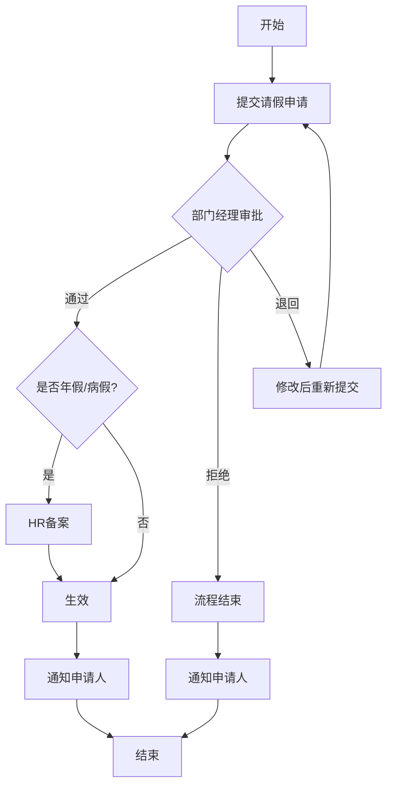
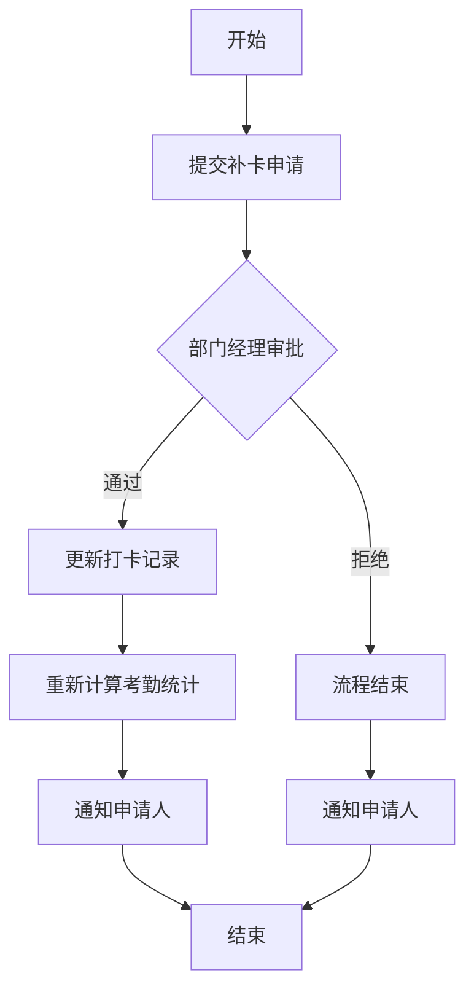
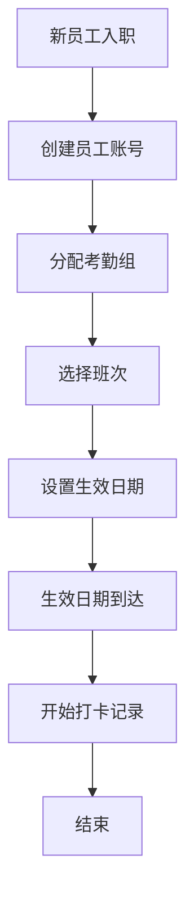

# 考勤管理系统 产品需求文档

## 文档信息

| 项目 | 内容 |
|------|------|
| 文档版本 | V1.0 |
| 创建日期 | 2026-03-24 |
| 最后修改 | 2026-03-24 |
| 文档作者 | 产品团队 |

## 修订历史

| 版本 | 日期 | 修改人 | 修改内容 |
|------|------|--------|----------|
| V1.0 | 2026-03-24 | - | 初始版本 |

---

## 1. 产品概述

### 1.1 产品简介

考勤管理系统是基于考勤门禁机的企业级考勤管理平台。系统通过对人员制定不同考勤计划，实现考勤记录统计、报表生成、异常管理、迟到/早退查看等核心功能。系统与考勤门禁机对接，自动同步打卡数据，为企业提供完整的考勤管理解决方案。

### 1.2 目标用户

- **企业员工**：需要查看个人考勤记录、提交请假/补卡申请的普通员工
- **HR管理员**：负责考勤规则配置、异常处理、报表统计的人力资源管理人员
- **部门经理**：负责审批下属考勤异常、查看团队考勤情况的管理人员
- **系统管理员**：负责系统配置、权限管理、数据维护的技术人员

### 1.3 核心价值

- **为TUMS3.0补充考勤能力**：完善平台功能体系，满足企业、园区等场景的考勤管理需求
- **避免系统割裂**：客户无需单独使用其他考勤系统，降低使用成本和管理复杂度
- **提升管理效率**：自动化考勤数据采集和处理，减少人工统计工作量
- **规范化管理**：标准化考勤流程，实现考勤数据的可追溯性

### 1.4 产品范围

本系统包含考勤组管理、班次管理、打卡记录、请假管理、考勤报表五大功能模块，支持与主流考勤门禁机对接，提供完整的考勤管理闭环。

---

## 2. 用户角色

### 2.1 角色概览

| 角色名称 | 角色类型 | 职责描述 | 使用场景 |
|----------|----------|----------|----------|
| 企业员工 | 业务角色 | 个人考勤查看、异常申请 | 日常上下班打卡、请假/补卡申请 |
| HR管理员 | 业务角色 | 考勤规则配置、异常处理、报表统计 | 制定考勤计划、处理考勤异常、生成报表 |
| 部门经理 | 业务角色 | 审批下属考勤异常、查看团队考勤 | 审批请假/补卡、监督团队出勤 |
| 系统管理员 | 系统角色 | 系统配置、权限管理、数据维护 | 系统初始化、用户权限分配 |

### 2.2 角色详情

#### 企业员工

| 属性 | 描述 |
|------|------|
| 角色类型 | 业务角色 |
| 职责描述 | 查看个人考勤记录，提交请假和补卡申请 |
| 使用场景 | 日常上下班打卡、请假申请、补卡申请、查看个人考勤统计 |
| 权限特征 | 仅查看个人考勤数据，无法查看他人数据 |

#### HR管理员

| 属性 | 描述 |
|------|------|
| 角色类型 | 业务角色 |
| 职责描述 | 考勤规则配置、异常处理、报表统计 |
| 使用场景 | 制定考勤计划、配置班次、处理考勤异常、生成考勤报表、假期余额管理 |
| 权限特征 | 管理全员考勤数据、配置权限、查看全公司报表 |

#### 部门经理

| 属性 | 描述 |
|------|------|
| 角色类型 | 业务角色 |
| 职责描述 | 审批下属考勤异常、查看团队考勤情况 |
| 使用场景 | 审批请假申请、审批补卡申请、查看部门考勤统计 |
| 权限特征 | 查看本部门考勤数据、审批权限 |

#### 系统管理员

| 属性 | 描述 |
|------|------|
| 角色类型 | 系统角色 |
| 职责描述 | 系统配置、权限管理、数据维护 |
| 使用场景 | 系统初始化、用户权限分配、数据同步配置 |
| 权限特征 | 全局管理权限、系统配置权限 |

---

## 3. 功能模块

### 3.1 模块概览

| 序号 | 模块名称 | 模块描述 | 核心功能 | 主要角色 |
|------|----------|----------|----------|----------|
| 1 | 考勤组 | 考勤组创建与管理 | 新增、查询、编辑、删除、批量导入 | HR管理员 |
| 2 | 班次管理 | 班次规则定义与管理 | 新增、查询、编辑、删除、详情 | HR管理员 |
| 3 | 打卡记录 | 打卡数据查看与管理 | 查询、详情、补卡申请、导出、同步 | 全部角色 |
| 4 | 请假管理 | 请假申请与审批管理 | 新增、查询、修改、撤销、审批、统计 | 企业员工、部门经理、HR管理员 |
| 5 | 考勤报表 | 考勤数据统计分析 | 日报、月报、异常统计、请假统计、导出 | HR管理员、部门经理 |

### 3.2 模块详情

#### 3.2.1 考勤组管理

**模块概述**

| 属性 | 描述 |
|------|------|
| 模块描述 | 考勤组的创建、维护和管理，用于对员工进行分组考勤管理 |
| 主要用途 | 将员工按不同考勤规则分组，便于差异化考勤管理 |
| 使用角色 | HR管理员 |

**功能清单**

| 功能ID | 功能名称 | 功能类型 | 操作角色 | 优先级 |
|--------|----------|----------|----------|--------|
| F01-01 | 新增考勤组 | 新增 | HR管理员 | 高 |
| F01-02 | 查询考勤组 | 查询 | HR管理员 | 高 |
| F01-03 | 编辑考勤组 | 修改 | HR管理员 | 高 |
| F01-04 | 删除考勤组 | 删除 | HR管理员 | 中 |
| F01-05 | 查看详情 | 查询 | HR管理员 | 高 |
| F01-06 | 批量导入考勤组 | 导入 | HR管理员 | 中 |

**功能详情**

##### F01-01 新增考勤组

| 属性 | 描述 |
|------|------|
| 功能ID | F01-01 |
| 功能类型 | 新增 |
| 操作角色 | HR管理员 |
| 优先级 | 高 |
| 前置条件 | 系统中存在可用班次 |
| 输入信息 | 考勤组名称、关联班次、考勤组成员、生效日期、备注 |
| 输出结果 | 创建成功提示、考勤组ID |
| 操作流程 | 填写考勤组信息 → 选择关联班次 → 添加成员 → 设置生效日期 → 提交保存 |

**输入字段定义**

| 字段名称 | 字段类型 | 是否必填 | 校验规则 | 默认值 | 说明 |
|----------|----------|----------|----------|--------|------|
| 考勤组名称 | text | 是 | 唯一性、长度≤50字符 | - | 考勤组标识名称 |
| 关联班次 | select | 是 | 必须存在 | - | 关联的班次模板 |
| 考勤组成员 | multiselect | 是 | 至少1人 | - | 考勤组包含的员工 |
| 生效日期 | date | 是 | 不早于当天 | 当天 | 考勤规则生效日期 |
| 备注 | textarea | 否 | 长度≤200字符 | - | 补充说明 |

**业务逻辑**

| 规则ID | 规则名称 | 规则类型 | 触发条件 | 处理逻辑 |
|--------|----------|----------|----------|----------|
| BL01-01 | 人员唯一性校验 | 校验规则 | 添加成员时 | 校验该人员是否已属于其他考勤组 |
| BL01-02 | 班次变更生效 | 触发条件 | 修改关联班次时 | 变更次日生效 |
| BL01-03 | 新成员考勤启动 | 数据联动 | 添加新成员时 | 按生效日期开始记录考勤 |

**约束条件**

| 约束ID | 约束类型 | 约束对象 | 约束描述 | 错误提示 |
|--------|----------|----------|----------|----------|
| C01-01 | 唯一性 | 考勤组名称 | 系统内不可重复 | 考勤组名称已存在 |
| C01-02 | 关联 | 删除操作 | 删除前需移除所有成员 | 请先移除考勤组成员 |
| C01-03 | 必填 | 考勤组名称 | 不能为空 | 请输入考勤组名称 |
| C01-04 | 必填 | 关联班次 | 不能为空 | 请选择关联班次 |

---

#### 3.2.2 班次管理

**模块概述**

| 属性 | 描述 |
|------|------|
| 模块描述 | 班次规则的创建与管理，定义不同的工作时段 |
| 主要用途 | 为不同岗位、不同人员提供差异化的上下班时间配置 |
| 使用角色 | HR管理员 |

**功能清单**

| 功能ID | 功能名称 | 功能类型 | 操作角色 | 优先级 |
|--------|----------|----------|----------|--------|
| F02-01 | 新增班次 | 新增 | HR管理员 | 高 |
| F02-02 | 查询班次 | 查询 | HR管理员 | 高 |
| F02-03 | 编辑班次 | 修改 | HR管理员 | 高 |
| F02-04 | 删除班次 | 删除 | HR管理员 | 中 |
| F02-05 | 班次详情 | 查询 | HR管理员 | 高 |

**功能详情**

##### F02-01 新增班次

| 属性 | 描述 |
|------|------|
| 功能ID | F02-01 |
| 功能类型 | 新增 |
| 操作角色 | HR管理员 |
| 优先级 | 高 |
| 前置条件 | 无 |
| 输入信息 | 班次名称、上班时间、下班时间、允许迟到时长、允许早退时长、是否需要打卡、备注 |
| 输出结果 | 创建成功提示、班次ID |
| 操作流程 | 填写班次信息 → 设置上下班时间 → 配置迟到早退容忍度 → 提交保存 |

**输入字段定义**

| 字段名称 | 字段类型 | 是否必填 | 校验规则 | 默认值 | 说明 |
|----------|----------|----------|----------|--------|------|
| 班次名称 | text | 是 | 唯一性、长度≤30字符 | - | 班次标识名称 |
| 上班时间 | time | 是 | - | 09:00 | 上班打卡截止时间 |
| 下班时间 | time | 是 | 必须晚于上班时间 | 18:00 | 下班打卡开始时间 |
| 允许迟到时长 | number | 否 | 0-120分钟 | 0 | 允许迟到的分钟数 |
| 允许早退时长 | number | 否 | 0-120分钟 | 0 | 允许早退的分钟数 |
| 是否需要打卡 | boolean | 是 | - | 是 | 是否要求打卡 |
| 备注 | textarea | 否 | 长度≤200字符 | - | 补充说明 |

**业务逻辑**

| 规则ID | 规则名称 | 规则类型 | 触发条件 | 处理逻辑 |
|--------|----------|----------|----------|----------|
| BL02-01 | 班次变更生效 | 触发条件 | 修改班次时间时 | 关联考勤组次日生效 |
| BL02-02 | 系统预置班次 | 其他 | 系统初始化 | 创建默认标准班次（9:00-18:00） |
| BL02-03 | 删除前校验 | 校验规则 | 删除班次时 | 检查是否被考勤组关联 |

**约束条件**

| 约束ID | 约束类型 | 约束对象 | 约束描述 | 错误提示 |
|--------|----------|----------|----------|----------|
| C02-01 | 唯一性 | 班次名称 | 系统内不可重复 | 班次名称已存在 |
| C02-02 | 格式 | 时间范围 | 下班时间必须晚于上班时间 | 下班时间必须晚于上班时间 |
| C02-03 | 关联 | 删除操作 | 已被关联的班次不可删除 | 该班次已被考勤组关联，无法删除 |
| C02-04 | 保护 | 系统预置 | 系统预置班次不可删除 | 系统预置班次不可删除 |

---

#### 3.2.3 打卡记录

**模块概述**

| 属性 | 描述 |
|------|------|
| 模块描述 | 打卡数据的管理与查看，支持从考勤门禁机同步数据 |
| 主要用途 | 展示员工打卡记录，支持补卡申请，为考勤统计提供数据基础 |
| 使用角色 | 企业员工、HR管理员、部门经理 |

**功能清单**

| 功能ID | 功能名称 | 功能类型 | 操作角色 | 优先级 |
|--------|----------|----------|----------|--------|
| F03-01 | 查看个人打卡记录 | 查询 | 企业员工 | 高 |
| F03-02 | 查询打卡记录 | 查询 | HR管理员/部门经理 | 高 |
| F03-03 | 打卡详情 | 查询 | 全部角色 | 高 |
| F03-04 | 补卡申请 | 新增 | 企业员工 | 高 |
| F03-05 | 导出打卡记录 | 导出 | HR管理员 | 中 |
| F03-06 | 数据同步 | 同步 | 系统管理员 | 高 |

**功能详情**

##### F03-01 查看个人打卡记录

| 属性 | 描述 |
|------|------|
| 功能ID | F03-01 |
| 功能类型 | 查询 |
| 操作角色 | 企业员工 |
| 优先级 | 高 |
| 前置条件 | 用户已登录 |
| 输入信息 | 日期范围筛选条件 |
| 输出结果 | 打卡记录列表 |
| 操作流程 | 选择日期范围 → 查看打卡记录 → 可查看详情或申请补卡 |

##### F03-04 补卡申请

| 属性 | 描述 |
|------|------|
| 功能ID | F03-04 |
| 功能类型 | 新增 |
| 操作角色 | 企业员工 |
| 优先级 | 高 |
| 前置条件 | 存在缺卡记录，且在当月内 |
| 输入信息 | 补卡日期、补卡时间、补卡原因 |
| 输出结果 | 提交成功提示，进入审批流程 |
| 操作流程 | 选择缺卡日期 → 填写补卡时间 → 填写补卡原因 → 提交审批 |

**输入字段定义**

| 字段名称 | 字段类型 | 是否必填 | 校验规则 | 默认值 | 说明 |
|----------|----------|----------|----------|--------|------|
| 补卡日期 | date | 是 | 当月内、存在缺卡记录 | - | 需要补卡的日期 |
| 补卡时间 | time | 是 | 符合班次时间范围 | - | 补卡的打卡时间 |
| 补卡原因 | textarea | 是 | 长度≤200字符 | - | 补卡的原因说明 |

**业务逻辑**

| 规则ID | 规则名称 | 规则类型 | 触发条件 | 处理逻辑 |
|--------|----------|----------|----------|----------|
| BL03-01 | 迟到早退判定 | 计算规则 | 同步打卡数据时 | 根据班次规则自动判定状态 |
| BL03-02 | 补卡审批流程 | 触发条件 | 提交补卡申请时 | 进入审批流程 |
| BL03-03 | 补卡生效 | 数据联动 | 审批通过时 | 更新打卡记录，重新计算考勤统计 |

**约束条件**

| 约束ID | 约束类型 | 约束对象 | 约束描述 | 错误提示 |
|--------|----------|----------|----------|----------|
| C03-01 | 范围 | 补卡时间 | 只能修改，不可直接删除 | 打卡记录不可删除 |
| C03-02 | 范围 | 补卡申请 | 需在当月内提交 | 仅支持当月内的补卡申请 |
| C03-03 | 唯一性 | 补卡申请 | 同一天同一班次只能补卡一次 | 该日期已存在补卡申请 |

---

#### 3.2.4 请假管理

**模块概述**

| 属性 | 描述 |
|------|------|
| 模块描述 | 请假申请的提交、审批和管理 |
| 主要用途 | 规范请假流程，管理假期余额，与考勤记录联动 |
| 使用角色 | 企业员工、部门经理、HR管理员 |

**功能清单**

| 功能ID | 功能名称 | 功能类型 | 操作角色 | 优先级 |
|--------|----------|----------|----------|--------|
| F04-01 | 新增请假申请 | 新增 | 企业员工 | 高 |
| F04-02 | 查询请假记录 | 查询 | 全部角色 | 高 |
| F04-03 | 修改请假申请 | 修改 | 企业员工 | 高 |
| F04-04 | 撤销请假申请 | 删除 | 企业员工 | 中 |
| F04-05 | 请假详情 | 查询 | 全部角色 | 高 |
| F04-06 | 请假审批 | 审核 | 部门经理/HR管理员 | 高 |
| F04-07 | 请假统计 | 统计 | HR管理员 | 中 |
| F04-08 | 假期余额管理 | 管理 | HR管理员 | 高 |

**功能详情**

##### F04-01 新增请假申请

| 属性 | 描述 |
|------|------|
| 功能ID | F04-01 |
| 功能类型 | 新增 |
| 操作角色 | 企业员工 |
| 优先级 | 高 |
| 前置条件 | 用户已登录，假期余额充足 |
| 输入信息 | 请假类型、开始时间、结束时间、请假原因 |
| 输出结果 | 提交成功提示、申请单号 |
| 操作流程 | 选择请假类型 → 设置时间范围 → 填写请假原因 → 提交审批 |

**输入字段定义**

| 字段名称 | 字段类型 | 是否必填 | 校验规则 | 默认值 | 说明 |
|----------|----------|----------|----------|--------|------|
| 请假类型 | select | 是 | - | - | 事假/病假/年假/婚假/产假/调休 |
| 开始时间 | datetime | 是 | 不早于当前时间 | - | 请假开始时间 |
| 结束时间 | datetime | 是 | 必须晚于开始时间 | - | 请假结束时间 |
| 请假时长 | number | 自动计算 | 按工作日计算 | - | 自动计算请假天数 |
| 请假原因 | textarea | 是 | 长度≤500字符 | - | 请假原因说明 |

##### F04-06 请假审批

| 属性 | 描述 |
|------|------|
| 功能ID | F04-06 |
| 功能类型 | 审核 |
| 操作角色 | 部门经理/HR管理员 |
| 优先级 | 高 |
| 前置条件 | 存在待审批的请假申请 |
| 输入信息 | 审批意见 |
| 输出结果 | 审批结果通知、状态更新 |
| 操作流程 | 查看申请详情 → 填写审批意见 → 选择通过/拒绝/退回 |

**业务逻辑**

| 规则ID | 规则名称 | 规则类型 | 触发条件 | 处理逻辑 |
|--------|----------|----------|----------|----------|
| BL04-01 | 请假时长计算 | 计算规则 | 提交请假申请时 | 自动按工作日计算请假天数 |
| BL04-02 | 假期余额扣减 | 数据联动 | 请假审批通过时 | 自动扣减对应假期余额 |
| BL04-03 | 考勤联动 | 数据联动 | 请假生效时 | 请假期间不计为缺勤 |
| BL04-04 | 修改限制 | 操作限制 | 修改/撤销时 | 仅待审批状态可操作 |

**约束条件**

| 约束ID | 约束类型 | 约束对象 | 约束描述 | 错误提示 |
|--------|----------|----------|----------|----------|
| C04-01 | 范围 | 请假时长 | 不能超过假期余额 | 假期余额不足 |
| C04-02 | 状态 | 修改操作 | 仅待审批状态可修改 | 当前状态不允许修改 |
| C04-03 | 状态 | 撤销操作 | 仅待审批状态可撤销 | 当前状态不允许撤销 |
| C04-04 | 时间 | 开始时间 | 不早于当天（新增时） | 请假开始时间不能早于今天 |

---

#### 3.2.5 考勤报表

**模块概述**

| 属性 | 描述 |
|------|------|
| 模块描述 | 考勤数据的统计分析与报表生成 |
| 主要用途 | 提供多维度考勤统计分析，支持报表导出 |
| 使用角色 | HR管理员、部门经理 |

**功能清单**

| 功能ID | 功能名称 | 功能类型 | 操作角色 | 优先级 |
|--------|----------|----------|----------|--------|
| F05-01 | 考勤日报 | 统计 | HR管理员/部门经理 | 高 |
| F05-02 | 考勤月报 | 统计 | HR管理员 | 高 |
| F05-03 | 异常统计 | 统计 | HR管理员 | 高 |
| F05-04 | 请假统计 | 统计 | HR管理员 | 中 |
| F05-05 | 自定义报表 | 统计 | HR管理员 | 中 |
| F05-06 | 导出报表 | 导出 | HR管理员 | 高 |

**功能详情**

##### F05-01 考勤日报

| 属性 | 描述 |
|------|------|
| 功能ID | F05-01 |
| 功能类型 | 统计 |
| 操作角色 | HR管理员/部门经理 |
| 优先级 | 高 |
| 前置条件 | 无 |
| 输入信息 | 日期、部门筛选条件 |
| 输出结果 | 日报统计数据 |
| 展示内容 | 出勤人数、迟到人数、早退人数、缺勤人数、请假人数 |

##### F05-02 考勤月报

| 属性 | 描述 |
|------|------|
| 功能ID | F05-02 |
| 功能类型 | 统计 |
| 操作角色 | HR管理员 |
| 优先级 | 高 |
| 前置条件 | 无 |
| 输入信息 | 月份、部门/人员筛选条件 |
| 输出结果 | 月报统计数据 |
| 展示内容 | 每人月度出勤天数、迟到次数、早退次数、请假天数、加班时长 |

**业务逻辑**

| 规则ID | 规则名称 | 规则类型 | 触发条件 | 处理逻辑 |
|--------|----------|----------|----------|----------|
| BL05-01 | 日报自动更新 | 触发条件 | 每日凌晨 | 自动更新前一天日报数据 |
| BL05-02 | 月报自动生成 | 触发条件 | 每月1日 | 自动生成上月月报 |
| BL05-03 | 手动刷新 | 触发条件 | 用户请求时 | 支持手动刷新报表数据 |

**约束条件**

| 约束ID | 约束类型 | 约束对象 | 约束描述 | 错误提示 |
|--------|----------|----------|----------|----------|
| C05-01 | 权限 | 部门经理 | 只能查看本部门报表 | 无权限查看该部门报表 |
| C05-02 | 保留期限 | 报表数据 | 保留12个月 | - |

---

## 4. 业务流程

### 4.1 流程概览

| 序号 | 流程名称 | 流程描述 | 参与角色 |
|------|----------|----------|----------|
| 1 | 请假审批流程 | 员工提交请假申请，经审批后生效 | 企业员工、部门经理、HR管理员 |
| 2 | 补卡审批流程 | 员工申请补录遗漏打卡，经审批后更新记录 | 企业员工、部门经理 |
| 3 | 新员工考勤配置流程 | 新员工入职后配置考勤信息 | HR管理员、企业员工 |

### 4.2 流程详情

#### 4.2.1 请假审批流程

**流程描述**

员工提交请假申请后，需经过部门经理审批，部分假期类型（年假、病假）还需HR备案，审批通过后自动生效并扣减假期余额。

**流程步骤**

| 步骤 | 操作名称 | 执行角色 | 输入 | 输出 | 备注 |
|------|----------|----------|------|------|------|
| 1 | 提交请假申请 | 企业员工 | 请假类型、时间范围、原因 | 待审批记录 | 系统自动计算时长 |
| 2 | 部门经理审批 | 部门经理 | 审批意见 | 审批结果 | 通过/拒绝/退回 |
| 3 | HR备案 | HR管理员 | - | 备案记录 | 仅年假/病假需备案 |
| 4 | 生效 | 系统 | - | 状态更新、余额扣减 | 通知申请人 |

**流程图**

**分支说明**

| 分支条件 | 处理方式 | 后续步骤 |
|----------|----------|----------|
| 审批通过 | 进入下一环节 | 年假/病假→HR备案，其他→直接生效 |
| 审批拒绝 | 流程结束 | 通知申请人 |
| 退回修改 | 退回申请人 | 修改后重新提交 |
| 超时未审批（48小时） | 自动提醒 | 提醒审批人处理 |
| 申请人在审批前撤回 | 流程终止 | 终止流程 |

---

#### 4.2.2 补卡审批流程

**流程描述**

员工发现打卡遗漏后，可提交补卡申请，经部门经理审批通过后，系统自动更新打卡记录。

**流程步骤**

| 步骤 | 操作名称 | 执行角色 | 输入 | 输出 | 备注 |
|------|----------|----------|------|------|------|
| 1 | 提交补卡申请 | 企业员工 | 补卡日期、时间、原因 | 待审批记录 | 限当月内申请 |
| 2 | 部门经理审批 | 部门经理 | 审批意见 | 审批结果 | 通过/拒绝 |
| 3 | 生效 | 系统 | - | 更新打卡记录 | 同步考勤统计 |

**流程图**

**分支说明**

| 分支条件 | 处理方式 | 后续步骤 |
|----------|----------|----------|
| 审批通过 | 更新打卡记录 | 重新计算考勤统计 |
| 审批拒绝 | 流程结束 | 通知申请人 |
| 超时未审批（24小时） | 自动提醒 | 提醒审批人处理 |

---

#### 4.2.3 新员工考勤配置流程

**流程描述**

新员工入职后，HR管理员为其分配考勤组，员工从生效日期开始进行打卡。

**流程步骤**

| 步骤 | 操作名称 | 执行角色 | 输入 | 输出 | 备注 |
|------|----------|----------|------|------|------|
| 1 | 员工入职 | HR管理员 | 员工信息 | 员工账号创建 | - |
| 2 | 分配考勤组 | HR管理员 | 考勤组、生效日期 | 考勤组关联 | 选择合适的班次 |
| 3 | 开始打卡 | 企业员工 | - | 打卡记录 | 按生效日期开始 |

**流程图**

---

## 5. 非功能需求

### 5.1 性能需求

| 需求ID | 需求项 | 指标要求 | 说明 |
|--------|--------|----------|------|
| NFR01 | 页面响应时间 | < 3秒 | 普通页面加载时间 |
| NFR02 | 接口响应时间 | < 1秒 | API接口响应时间 |
| NFR03 | 并发用户数 | 支持200+用户同时在线 | 正常业务场景 |
| NFR04 | 打卡数据同步延迟 | < 5分钟 | 从门禁机同步到系统 |
| NFR05 | 报表生成时间 | < 10秒 | 标准报表生成 |

### 5.2 安全需求

| 需求ID | 需求项 | 描述 |
|--------|--------|------|
| NFR06 | 身份认证 | 支持用户名密码登录 |
| NFR07 | 权限控制 | 基于角色的权限控制（RBAC） |
| NFR08 | 数据安全 | 敏感数据加密存储、定期数据备份 |
| NFR09 | 传输安全 | HTTPS加密传输 |
| NFR10 | 审计日志 | 操作日志、登录日志记录 |
| NFR11 | 安全防护 | 防SQL注入、防XSS攻击 |

### 5.3 兼容性需求

| 需求ID | 需求项 | 要求 |
|--------|--------|------|
| NFR12 | 浏览器支持 | Chrome、Edge、Firefox（最新2个版本） |
| NFR13 | 设备支持 | PC端为主 |
| NFR14 | 屏幕分辨率 | 1920×1080、1366×768自适应 |
| NFR15 | 打卡设备对接 | 支持主流考勤门禁机数据接入 |

### 5.4 可用性需求

| 需求ID | 需求项 | 要求 |
|--------|--------|------|
| NFR16 | 系统可用性 | 99.5% |
| NFR17 | 数据备份 | 每日增量备份，每周全量备份 |

---

## 6. 附录

### 6.1 术语说明

| 术语 | 说明 |
|------|------|
| 考勤组 | 具有相同考勤规则的员工集合，关联同一班次 |
| 班次 | 定义上下班时间和迟到早退容忍度的工作时段模板 |
| 补卡 | 员工因忘记打卡等原因申请补录打卡记录 |
| RBAC | 基于角色的访问控制（Role-Based Access Control） |
| TUMS | 统一管理平台系统（Total Unified Management System） |

### 6.2 参考文档

| 文档名称 | 说明 |
|----------|------|
| TUMS3.0系统架构文档 | 系统整体架构设计 |
| 考勤门禁机接口规范 | 打卡设备数据对接规范 |
| 企业考勤管理制度 | 企业内部考勤管理规则 |

### 6.3 相关系统

| 系统名称 | 关系 | 说明 |
|----------|------|------|
| TUMS3.0平台 | 父系统 | 考勤管理作为TUMS3.0的子系统 |
| 考勤门禁机系统 | 数据来源 | 提供打卡数据 |
| 人力资源系统 | 数据关联 | 提供员工组织架构数据 |